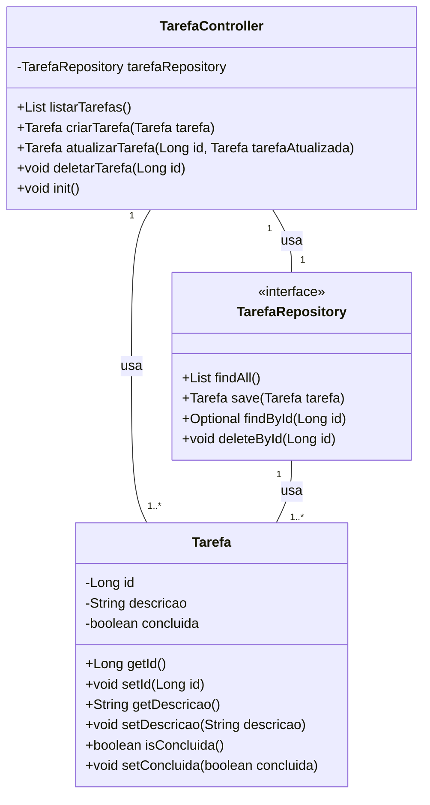

# Projeto Gerenciador de Tarefas 
Java RESTful API criada para Decola Tech 2025

## Diagrama de Classes

```mermaid
classDiagram
    class Tarefa {
        -Long id
        -String descricao
        -boolean concluida
        +Long getId()
        +void setId(Long id)
        +String getDescricao()
        +void setDescricao(String descricao)
        +boolean isConcluida()
        +void setConcluida(boolean concluida)
    }

    class TarefaController {
        -TarefaRepository tarefaRepository
        +List<Tarefa> listarTarefas()
        +Tarefa criarTarefa(Tarefa tarefa)
        +Tarefa atualizarTarefa(Long id, Tarefa tarefaAtualizada)
        +void deletarTarefa(Long id)
        +void init()
    }

    class TarefaRepository {
        <<interface>>
        +List<Tarefa> findAll()
        +Tarefa save(Tarefa tarefa)
        +Optional<Tarefa> findById(Long id)
        +void deleteById(Long id)
    }

    TarefaController "1" -- "1" TarefaRepository : usa
    TarefaController "1" -- "1..*" Tarefa : usa
    TarefaRepository "1" -- "1..*" Tarefa : usa
```
